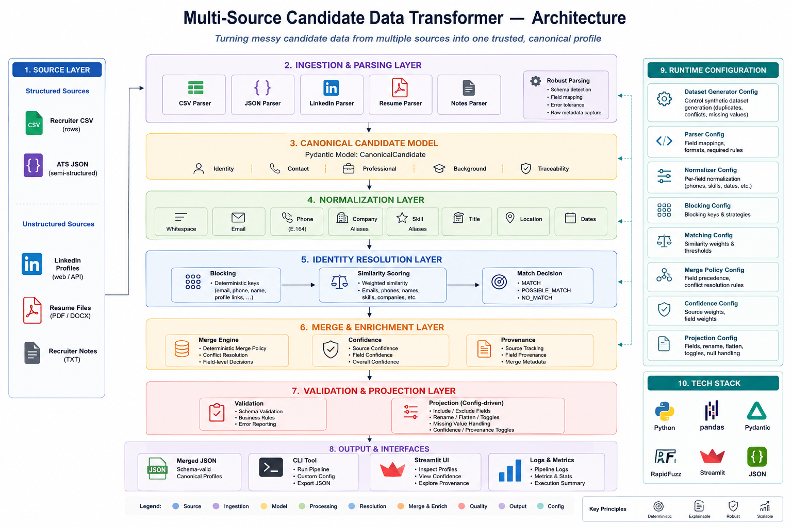

<div align="center">

# Multi-Source Candidate Data Transformer

Deterministic candidate profile consolidation from structured and unstructured data sources.


</div>

## Project Overview
This project consolidates candidate data from recruiter CSV exports, ATS JSON exports, LinkedIn-style text profiles, and Markdown resumes into a single canonical candidate representation. It solves fragmented recruiting data problems such as duplicate identities, inconsistent formatting, conflicting values, and missing fields. The pipeline parses source-specific inputs, normalizes them into a shared schema, performs deterministic identity resolution, and merges confirmed matches into canonical profiles. Each merged field carries confidence metadata and provenance so every selection remains explainable. Final output is projected through runtime JSON configuration, allowing field selection, renaming, flattening, and metadata toggles without changing pipeline code.

## Features
- Multi-source ingestion
- Structured + unstructured parsing
- Data normalization
- Identity resolution
- Candidate merging
- Confidence scoring
- Provenance tracking
- Runtime configurable output
- Schema validation
- Streamlit dashboard

## Project Architecture


## Technology Stack
| Area | Technology |
| --- | --- |
| Language | Python |
| Framework | Streamlit |
| Libraries | Pandas, Pydantic, RapidFuzz, phonenumbers, python-dateutil |
| Validation | Pydantic-based canonical models and schema validation |
| Dashboard | Streamlit |
| Testing | Pytest |

## Project Structure
```text
multi-source-candidate-data-transformer/
├── .gitignore
├── DESIGN.md
├── DESIGN.pdf
├── PROJECT_SUMMARY.md
├── README.md
├── SUBMISSION_CHECKLIST.md
├── generate_dataset.py
├── main.py
├── pytest.ini
├── requirements.txt
├── streamlit_app.py
├── config/
│   ├── company_aliases.json
│   ├── confidence_config.json
│   ├── matching_config.json
│   ├── output_config.json
│   └── skill_aliases.json
├── datasets/
│   ├── ats.json
│   ├── dataset_summary.json
│   ├── recruiter.csv
│   ├── linkedin/
│   └── resume/
├── docs/
│   ├── Canonical_CandidateSchema.png
│   ├── Merge_&_DecisionLogic_diagram.png
│   ├── OverallArchitecture_diagram.png
│   ├── Pipeline_Diagram.png
│   ├── Runtime_Config_Diagram.png
│   ├── Workflow_diagram.png
│   └── architecture.md
├── logs/
│   └── pipeline.log
├── outputs/
│   └── merged_candidates.json
├── screenshots/
├── src/
│   └── candidate_data_transformer/
│       ├── datasets/
│       ├── matching/
│       ├── merging/
│       ├── models/
│       ├── normalizers/
│       ├── parsers/
│       ├── projection/
│       ├── validator/
│       ├── __init__.py
│       └── pipeline.py
└── tests/
    ├── test_end_to_end.py
    ├── test_matching.py
    ├── test_merging.py
    ├── test_normalizers.py
    ├── test_parsers.py
    └── test_projection_validator.py
```

## Installation
```powershell
git clone https://github.com/santhoshkumar1204/candidate-data-transformer.git
cd candidate-data-transformer
python -m venv .venv
.venv\Scripts\Activate.ps1
python -m pip install -r requirements.txt
```

## Running the Project
CLI execution:

```powershell
python main.py --run --config config/output_config.json --output outputs/merged_candidates.json
```

Streamlit dashboard:

```powershell
streamlit run streamlit_app.py
```

Optional dataset generation:

```powershell
python main.py --generate-data 100
```

## Runtime Configuration
Runtime projection behavior is controlled through `config/output_config.json`. The configuration allows users to select which fields appear in the final output, rename output keys, flatten nested objects, and toggle confidence or provenance metadata. This keeps output customization separate from parsing, matching, merging, and validation logic.

## Sample Output
Generated merged output is written to `outputs/merged_candidates.json`.

## Testing
The repository includes automated tests for parsing, normalization, matching, merging, projection, validation, and end-to-end execution.

Run the test suite with:

```powershell
python -m pytest
```

## Documentation
Included repository documentation and diagrams:

- Technical Design PDF: `DESIGN.pdf`
- Architecture Diagram: `docs/OverallArchitecture_diagram.png`
- Pipeline Diagram: `docs/Pipeline_Diagram.png`
- Workflow Diagram: `docs/Workflow_diagram.png`
- Canonical Schema: `docs/Canonical_CandidateSchema.png`
- Merge Logic: `docs/Merge_&_DecisionLogic_diagram.png`
- Runtime Configuration Diagram: `docs/Runtime_Config_Diagram.png`

## Demo Video
Demo Video

`https://drive.google.com/file/d/1jEsNnVaVHhx5743HBSD-jnhXXvNe9Pn6/view?usp=drivesdk`
